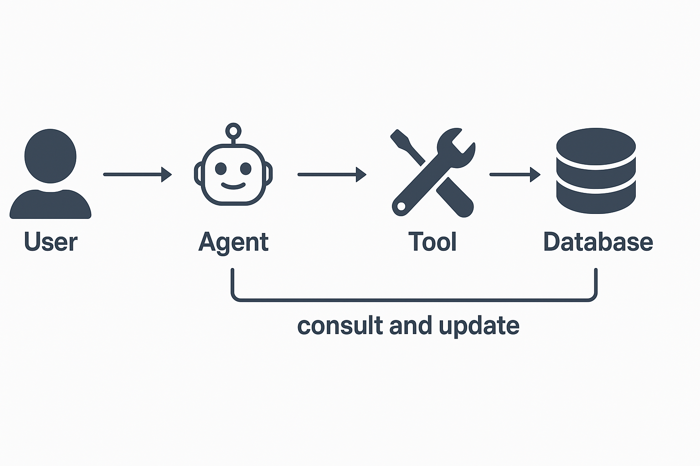

# 🧳 Virtual Travel Agent Chat

An AI-powered **flight and hotel scheduler & buyer assistant** built with Streamlit and LangChain. This virtual agent helps users **find flights and hotels**, **compare options**, **schedule trips**, and even **book travel** with user approval.

---

## ✨ Features

- ✈️ **Search & Schedule Flights**
- 🏨 **Find and Reserve Hotels**
- 📅 **Manage and View Itineraries**
- 🤖 **Conversational Booking Assistant**
- 🔐 **User Approval for Actions**
- 📈 **Personalized Recommendations**

---



**🎥 Demo GIF**
   Here's a quick demonstration of the Virtual Travel Agent in action:
   - **Main Interface:** A clean and intuitive chatbot interface.
   - **Human-in-the-Loop Approval System:** A mechanism where sensitive actions, like flight update, require user approval.

   


## ⚙️ Setup Instructions

### 1. Clone the repository

```bash
git clone https://github.com/yourusername/virtual-sales-agent.git
cd virtual-sales-agent
```

2. Install dependencies

```bash

pip install -r requirements.txt

```

3. Set up environment variables
Copy the example file and edit your API keys:

```bash
cp .env-example .env

```

Edit .env:

``` env
OPENAI_API_KEY=your-openai-key
TAVILY_API_KEY=your-tavily-key

```

4. Run the app

```bash
streamlit run main.py

```

The app will open in your browser at http://localhost:8501.

📁 Project Structure

```
.
├── .env                  # Environment variables (keep secret)
├── .env-example          # Template for environment setup
├── .gitignore            # Files to ignore in version control
├── assets/
│   └── style.css         # Custom styles for the Streamlit app
├── main.py               # Entry point of the application
├── travel2.sqlite        # SQLite database with travel/trip data

```


🛠 **Tech Stack
Python** 🐍

```
Streamlit – UI for the chat experience

LangChain – Orchestrates the AI agent logic

SQLite – Stores travel and order-related data

OpenAI API – Powers the conversational AI

Tavily API – (Optional) API used by tools in the assistant's toolbox

```